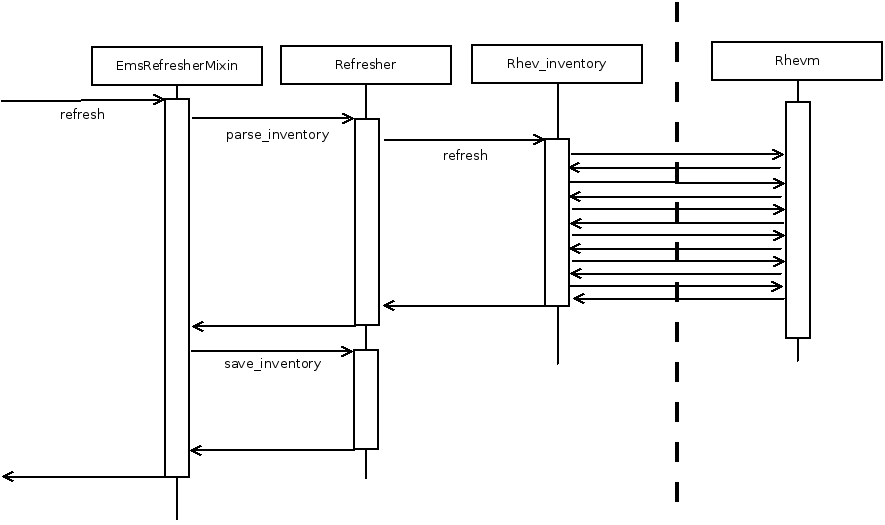
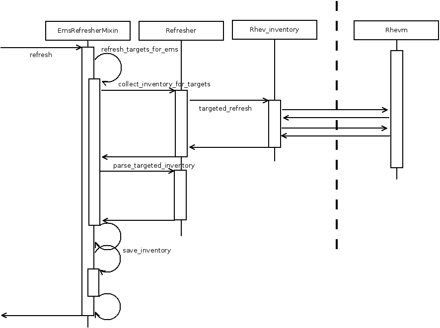

class: center, middle, inverse

# The next level oVirt provider

## What did we do
## and how can you do it too!

### [Piotr Kliczewski](mailto:pkliczew@redhat.com)
### [Juan Hernández](mailto:jhernand@redhat.com)
#### Jun 6th 2016

---

class: center, middle

# Objective

The objective of this session is to present the work that the oVirt and
ManageIQ teams have been doing together to improve the integration of
both systems for the ManageIQ Darga release, and the plans to improve it
even further for the upcoming release of oVirt 4.

---

## Agenda

These are the items that we will cover in this session:

- [Introduction](#introduction)

- [Improvements for the Darga release](#darga)

- [Future improvements](#future)

- [Demo](#demo)

---

name: introduction
class: center, middle, inverse

# Introduction

???

In this introduction we should very quicly explain what is oVirt and how
other systems can be integrated using the API.

---

# What is oVirt?

- A virtualization platform.

- Manages virtual machines, storage and networks.

- Easy to use web interface, for humans.

- Comprehensive REST API, for other systems.

- Integrated with ManageIQ as a infrastructure provider, via the REST
  API.

???

Worth also mentioning that it is Open Source, and based on KVM and
Linux.

---

name: darga
class: center, middle, inverse

## Improvements for the Darga release

---

## Improvements

- Targeted refresh

- Gluster support

- oVirt 4 support - in progress

---

## Inventory refresh



---

## Targeted refresh



---

## Targeted refresh, the numbers

???

Let's wait for the results from scale testing

---

## Changes needed to target refreshes

- implement collect_inventory_for_targets
  and use ExtManagementSystem, Host, VmOrTemplate

- implement parse_targeted_inventory

- understand data model dependencies

---

## Gluster support

- new storage type for data-store tree

- new icon to be shown on the data store quadicon for gluster

- support for GlusterFS in SSA

---

## Initial support for version 4 of oVirt

- Version 4 of oVirt will support two versions of the API

- Version 3 of the API will be identical to the current one

- New features will only be available in version 4 of the API

- Initial suppport for the API backwards compatibility mode has been
  added, so that Darga will work with version 4 of oVirt out of the
  box

???

The key point here is that in order to use the new capabilities of oVirt
it is mandatory to use version 4 of the API, version 3 is only for
temporary backwards compatbility.

---

name: future
class: center, middle, inverse

## Future improvements

---

## Future improvements

- Add support for the new features introduced in oVirt 4, gradually
  switching from the existing _ovirt_ gem to the new oVirt Ruby SDK

---

## What are the incovenients of the existing _ovirt_ gem?

- Only supports a subset of the oVirt API

- Every new addition or change to the oVirt API requires manual changes
  to the gem

- It is an additional maintenance load for the ManageIQ team

---

## What are the advantages of the oVirt Ruby SDK?

- It supports 100% of the capabilities of the oVirt API

- It is automatically generated from the same specification than the
  oVirt API server itself, so it is guaranteed to be always in sync

- It is [documented](https://jhernand.fedorapeople.org/ovirt-engine-sdk-ruby/)

- It is already available in [rubygems.org](https://rubygems.org/gems/ovirt-engine-sdk)

- It is maintained by the oVirt team 

???

It is worth mentioning some things that are already available in the
Ruby SDK but that would require considerable effort to implement in the
_ovirt_ gem:

* Support for all the types, services and methods.

* Link following.

* Compression support.

* Authentication using SSO, which will be mandatory starting with
  version 4.1 of the server.

It is also fair to explain that there are also inconvenients with this
approach, the most important being that the SDK is very different to the
existing _ovirt_ gem, so the effort to switch is considerable. The second
disadvantage it that it only works with version 4 of the API.

---

## A glimpse of the oVirt Ruby SDK (I)

```ruby
require 'ovirtsdk4'

# Create the connection to the server:
connection = OvirtSDK4::Connection.new({
  :url => 'https://engine40.example.com/ovirt-engine/api',
  :username => 'admin@internal',
  :password => 'redhat123',
})

# Get the reference to the "vms" service:
vms_service = connection.system_service.vms_service

# Use the "list" method of the "vms" service to list all
# the virtual machines of the system:
vms = vms_service.list

# Print the virtual machine names and identifiers:
vms.each do |vm|
  puts "#{vm.name}: #{vm.id}"
end

```

???

The idea of this example is to explain that the SDK is simple to use,
and that it abstracts out all the details of authentication, HTTP
communication and XML parsing/rendering.

---

## A glimpse of the oVirt Ruby SDK (II)

```ruby
# Find the virtual machine:
vm = vms_service.list({:search => 'name=myvm'})[0]

# When the server returns a virtual machine it will return
# links to related objects, like the cluster and the template,
# something like this:
#
# <cluster id="123" href="/api/clusters/123"/>
# <template id="456" href="/api/templates/456"/>
#
# The SDK provides a "follow_link" method that can be used
# to retrieve the complete content of these related objects.
cluster = connection.follow_link(vm.cluster)
template = connection.follow_link(vm.template)

# Now we can use the details of the cluster and the template:
puts "cluster: #{cluster.name}"
puts "template: #{template.name}"
```

???

We should probably skip this slide, not that important.

---

## New version drop-down in the GUI

- The GUI will be modified to add a drop-down where the user can select
  the version of the API

- When version 3 is selected the provider will use the _ovirt_ gem

- When version 4 is selected the provider will use the Ruby SDK

---

## New base classes for each provider class

- For each class of the existing provider a new `Ovirt4` parent
  class will be introduced. For example, for the provider itself:

```ruby
# The new provider class:
class ManageIQ::Providers::Ovirt4::InfraManager <
      ManageIQ::Providers::InfraManager
 ...
end
```

```ruby
# The existing provider class extends the new one:
class ManageIQ::Providers::Redhat::InfraManager <
      ManageIQ::Providers::Ovirt4::InfraManager
 ...
end
```

- Same for other classes.

---

## The new _Ovirt4_ provider classes will use only the Ruby SDK

- The new `Ovirt4` classes will only use the Ruby SDK, and they will
  work only with version 4 of the API

- The existing `Redhat` provider will check the value given in the GUI
  version drop-down, and either call the parent class if version is 4,
  or use the _ovirt_ gem, like it does today, if version is 3.

---

## Remove the _Redhat_ classes when support for oVirt 3 is dropped

- Eventually, when the switch is complete and support for version of 3
  of oVirt is dropped, the `Redhat` classes will be removed, and only
  new `Ovirt4` classes will remain.

---

name: demo
class: center, middle, inverse

## Demo

---

name: what-else
class: center, middle

## What else?

---

class: center, middle, inverse

# Thanks!
